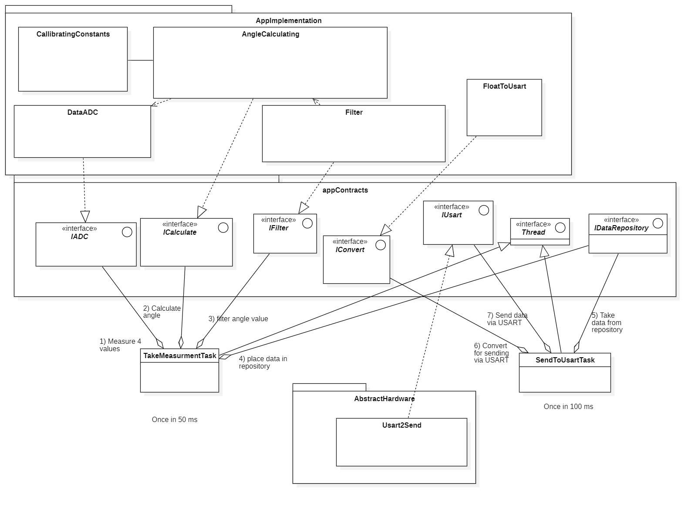
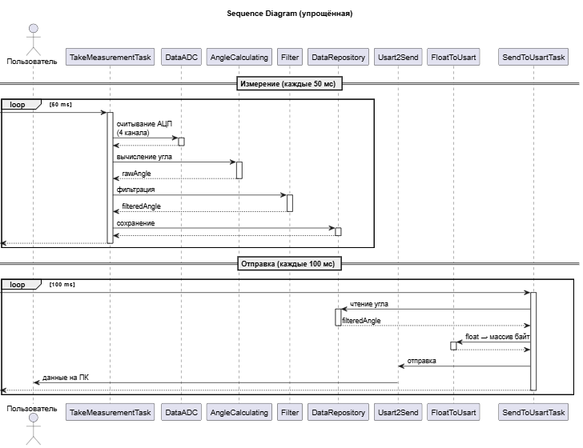

Архитектура программного обеспечения разрабатываемого устройства построена по многоуровневому принципу и включает четыре основных уровня: задачи приложения (Tasks), бизнес-логика (ApplicationImplementation), интерфейсы-контракты (appContracts) и уровень абстрактного аппаратного обеспечения (AbstractHardware).

.Архитектура проекта

=== Задачи (Tasks)

. TakeMeasurementTask — задача измерения, запускаемая с периодом 50 миллисекунд. Данная задача выполняет следующие функции:

* Измерение четырёх значений с датчика TLE5009 через интерфейс IADC;

* Вычисление угла с использованием интерфейса ICalculate;

* Фильтрацию полученного значения через интерфейс IFilter;

* Помещение обработанных данных в репозиторий.

. SendToUsartTask — задача отправки данных, запускаемая с периодом 100 миллисекунд. Данная задача:

* Забирает отфильтрованные данные из репозитория через IDataRepository;

* Преобразует данные в формат, пригодный для передачи по USART, используя интерфейс IConvert;

* Отправляет преобразованные данные через интерфейс IUsart.

=== Интерфейсы (AppContracts)

Уровень определяет абстрактные интерфейсы, служащие для описания необходимых функций.

.Интерфейсы приложения (appContracts)
[cols="1,2", options="header"]
|===
| Интерфейс | Назначение
| IADC | Абстракция АЦП 
| ICalculate | Абстракция вычисления угла с калибровкой
| IFilter | Абстракция цифрового фильтра
| IConvert | Абстракция преобразования float → массив байт
| IUsart | Абстракция USART 
| IThread | Абстракция потока RTOS
| IDataRepository | Абстракция хранилища данных между задачами
|===

=== Реализация интерфейсов (ApplicationImplementation)

Данный уровень содержит классы, реализующие алгоритмы обработки данных.

* CalibrationConstants — класс, хранящий калибровочные константы датчика TLE5009: амплитуды синусного и косинусного сигналов, смещения и поправку угла.

* DataADC — класс, представляющий структуру для получения и хранения сырых данных, полученных с АЦП (четыре значения).

* AngleCalculating — класс, выполняющий вычисление угла на основе сырых данных АЦП с учётом калибровочных констант. Данный класс реализует интерфейс ICalculate и использует данные из DataADC и CalibrationConstants.

* Filter — класс, реализующий цифровой фильтр нижних частот первого порядка (согласно техническому заданию) для работы с данными, полученными с помощью класса AngleCalculating. Класс реализует интерфейс IFilter.

* FloatToUsart — класс, преобразующий значение угла из формата с плавающей запятой в массив байт, пригодный для передачи по USART. Класс реализует интерфейс IConvert.

=== AppHardware

Usart2Send — класс, реализующий низкоуровневую работу с периферийным модулем USART2 микроконтроллера. Данный класс реализует интерфейс IUsart и выполняет непосредственную отправку байтов через регистр USART_DR.

=== Взаимодействия компонентов

Агрегации задач:

. TakeMeasurementTask использует ссылки на созданные данные из интерфейсов: IADC, ICalculate, IFilter, IDataRepository;

. SendToUsartTask использует ссылки на созданные данные: IConvert, IUsart, IDataRepository.

Задачи так же наследуют IThread через Thread.

Реализация интерфейсов:

. AngleCalculating реализует ICalculate;

. Filter реализует IFilter;

. FloatToUsart реализует IConvert;

. Usart2Send реализует IUsart.

Ассоциации (использование данных):

. AngleCalculating использует данные, полученные через DataADC, и использует CalibrationConstants.

=== Поток данных, временная диаграмма

.Временная диаграмма процесса

. Измерение (50 мс): TakeMeasurementTask → IADC → сырые данные → DataADC → AngleCalculating (через ICalculate) → угол → Filter (через IFilter) → отфильтрованный угол → репозиторий (через IDataRepository).

. Отправка (100 мс): SendToUsartTask → репозиторий (через IDataRepository) → отфильтрованный угол → FloatToUsart (через IConvert) → массив байт → Usart2Send (через IUsart) → USART2 → Bluetooth → ПК.

Программа будет состоять из двух задач, TakeMeasurementTask и SendToUsartTask.

Первая задача считывает данные канала с АЦП (DataADC) и рассчитывает с их помощью угол (AngleCalculating). Затем вызывает функцию фильтрации (из Filter) и возвращает значение отфильтрованного угла, сохраняя в репозиторий (DataRepository).

Вторая задача имеет доступ в репозиторий, откуда забирает значение угла для преобразования его в удобный для передачи формат по Usart (FloatToUsart). Затем задача отправляет данные по Usart (Usart2Send), откуда данные попадают на ПК.

Так как периодичность включения второй задачи реже, то пусть ее приоритет будет выше. Тогда для обеспечения целостности данных требуется поставить блокировку на запись значения в репозиторий (в первую задачу).