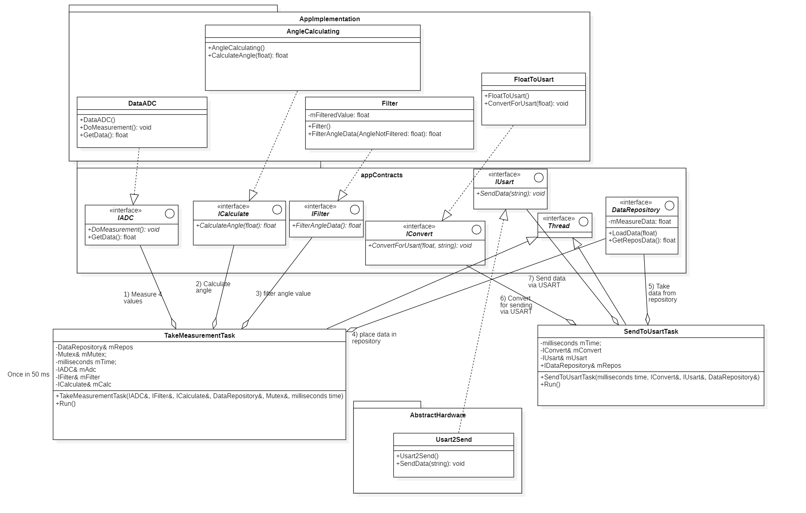

=== Итоговый дизайн

.Дизайн

=== IADC и IDataADC

Этот модуль имеет 2 функции:

* void DoMeasurement()::не возвращает никаких данных, только производит измерение.
* float GetData()::считывает код АЦП из регистра данных и возвращает значение в формате float.
 

.IADC.h
[source, cpp]
----
include::CODE_for_kursach/ADC/Contracts/IADC.h[]
----

.IDataADC.h
[source, cpp]
----
include::CODE_for_kursach/ADC/DataADC.h[]
----

.IDataADC.cpp
[source, cpp]
----
include::CODE_for_kursach/ADC/DataADC.cpp[]
----

=== ICalculate и AngleCalculating

* float CalculateAngle(float buffer) -- метод объявляется в интерфейсе и реализуется в классе. Метод пересчитывает код АЦП и возвращает значение угла.

.ICalculate.h

[source, cpp]
----
include::CODE_for_kursach/Calculate/Contracts/ICalculate.h[]
----

.AngleCalculating.h
[source, cpp]
----
include::CODE_for_kursach/Calculate/AngleCalculating.h[]
----

.AngleCalculating.cpp
[source, cpp]
----
include::CODE_for_kursach/Calculate/AngleCalculating.cpp[]
----

=== IFilter и Filter

* float FilterData(dataNotFiltered) -- метод объявляется в интерфейсе и реализуется в классе. Принимает нефильтрованное значение и возвращает отфильтрованное.
* float mFilteredAngle -- поле, хранящее последнее отфильтрованное значение. Нужно для работы.
* Filter() -- конструктор класса. Нужен для инициализации начального значения поля mFilteredAngle нулем.

.IFilter.h
[source, cpp]
----
include::CODE_for_kursach/Filter/Contracts/IFilter.h[]
----

.Filter.h
[source, cpp]
----
include::CODE_for_kursach/Filter/Filter.h[]
----

.Filter.cpp
[source, cpp]
----
include::CODE_for_kursach/Filter/Filter.cpp[]
----

=== IConvert и FloatToUsart

* void ConvertForUsart(float filteredValue, char* bufferValue) -- метод объявлен в интерфейсе и реализован в классе. Принимает значение угла и конвертирует его в строку для отправки по USART.

.IConvert.h
[source, cpp]
----
include::CODE_for_kursach/Converter/Contracts/IConvert.h[]
----

.FloatToUsart.h
[source, cpp]
----
include::CODE_for_kursach/Converter/FloatToUsart.h[]
----
.FloatToUsart.cpp
[source, cpp]
----
include::CODE_for_kursach/Converter/FloatToUsart.cpp[]
----

=== IUsart и Usart2Send

*  void SendData(char* buffer) const -- метод объявлен в интерфейсе и реализован в классе. Реализует полный цикл отправки строки по USART с использованием регистров буфера данных и бита статуса регистра данных.

.IUsart.h
[source, cpp]
----
include::CODE_for_kursach/Usart/Contracts/IUsart.h[]
----

.Usart2Send.h
[source, cpp]
----
include::CODE_for_kursach/Usart/Usart2Send.h[]
----

.Usart2Send.cpp
[source, cpp]
----
include::CODE_for_kursach/Usart/Usart2Send.cpp[]
----

=== DataRepository

float GetData() const -- метод получения данных репозитория, возвращает значение mData;
void LoadData(float data) -- метод, записывающий в поле mData класса значение угла;
float mData -- поле хранит данные между двумя тасками.

.DataRepository.h
[source, cpp]
----
include::CODE_for_kursach/Repository/DataRepository.h[]
----

.DataRepository.cpp
[source, cpp]
----
include::CODE_for_kursach/Repository/DataRepository.cpp[]
----

=== Tasks

=== TakeMeasurementTask

.TakeMeasurementTask.h
[source, cpp]
----
include::CODE_for_kursach/Tasks/TakeMeasurementTask.h[]
----

.TakeMeasurementTask.cpp
[source, cpp]
----
include::CODE_for_kursach/Tasks/TakeMeasurementTask.cpp[]
----

=== SendToUsartTask

.SendToUsartTask.h
[source, cpp]
----
include::CODE_for_kursach/Tasks/TakeMeasurementTask.h[]
----

.SendToUsartTask.cpp
[source, cpp]
----
include::CODE_for_kursach/Tasks/SendToUsartTask.cpp[]
----

=== main

.main.cpp
[source, cpp]
----
include::CODE_for_kursach/main.cpp[]
----