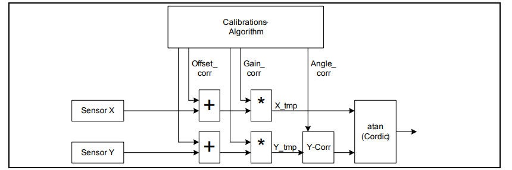
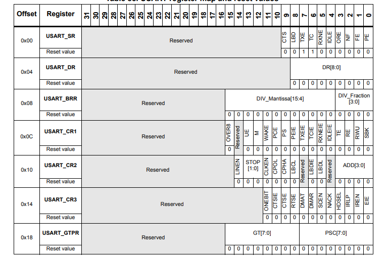
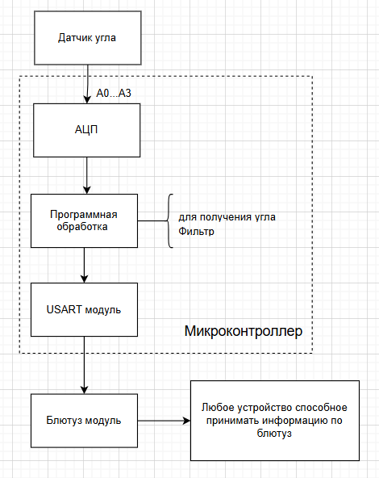

:toc:
:toc-title: Оглавление
:figure-caption: Рисунок
:table-caption: Таблица
:stem: 

:eqnums:

[.text-center]
[discrete]
= Курсовая работа
//

[.text-center]
Разработка устройства определения положения объекта с передачей параметров на ПК
//

include::titul.adoc[]

[.text-center]
Южно-Уральский государственный университет (НИУ)
Высшая школа электроники и компьютерных наук
Кафедра «Информационно-измерительная техника»
//

[.text-right]
УТВЕРЖДАЮ +
Заведующий кафедрой +
&#95;&#95;&#95;&#95;&#95;&#95;&#95;&#95;&#95; (М.Н. Самодурова) +
&#95;&#95;&#95;&#95;&#95;&#95;&#95;&#95;&#95;&#95;&#95;&#95;&#95;&#95;&#95;&#95;&#95;&#95;&#95;&#95;&#95;&#95; 2025 г.
//

[.text-center]
*ЗАДАНИЕ НА РАБОТУ* +
на курсовую работу
студентам: +
Долгих Евгения Владимировна и Жуламанова Арина Маратовна +
группа: КЭ-413
//

{nbsp} +
{nbsp} +
{nbsp} +

[.text-left]
1. *Дисциплина:* *_Программное обеспечение измерительных процессов._*
2. *Тема работы:* *_Разработка устройства определения положения объекта с передачей параметров на ПК_*
3. *Требования к разработке:*
* Для разработки должна использоваться отладочная плата https://www.waveshare.com/product/arduino-2/boards-kits/nucleo/xnucleo-f411re.htm[XNUCLEO-F411RE]
* Программное обеспечение должно измерять положение платы в пространстве X, Y
** Устройство должно измерять угол наклона и ускорение измеряемого объекта
** Период измерения должен быть 50 ms.
** К измеренным значениям параметров должен быть применен цифровой фильтр вида: +
stem:[tau = int  ((1-e^(-dt/(R*C)), RC > 0 sec), (1, RC<= 0 sec))] +
{nbsp} +
stem:["FilteredValue" = "OldFiltered" + ("Value" - "OldValue") * tau], +
{nbsp} +
где dt -  100 мс; +
Value – текущее нефильтрованное измеренное значение температуры; +
oldValue -  предыдущее фильтрованное значение.
** Для измерения параметров должен использоваться датчик TLE5009
** Получение данных с датчика TLE5009 должно производиться с помощью АЦП

* Вывод значений
** Вывод значений должен осуществляться через USART2 на скорости 19200 кБит/с 
** Период вывода информации раз в 100ms
* Архитектура должна быть представлена в виде UML диаграмм в пакете Star UML
* Приложение должно быть написано на языке С++ с использованием компилятора ARM 8.40.2
* При разработке должна использоваться Операционная Система Реального Времени FreeRTOS и https://github.com/lamer0k/RtosWrapper[С++ обертка над ней]

4. *Перечень вопросов, подлежащих разработке:*
* В ходе работы необходимо разработать архитектуру программного обеспечения в виде диаграммы UML.
* В ходе работы необходимо разработать код программного обеспечения.
** Код должен соответствовать стандарту кодирования https://tproger.ru/translations/stanford-cpp-style-guide/[Стэнфордского университета], см также https://stanford.edu/class/archive/cs/cs106b/cs106b.1158/styleguide.shtml[оригинал]
* Работа программы должна быть продемонстрирована совместно с платой XNUCLEO-F411RE.
* Содержание работы должно соответствовать ГОСТ 19.402–78 «Единая система программной документации. Описание программы».
** Работа должна быть оформлена в формате Asciidoc и выложена на Github
* Описание архитектуры в виде UML диаграмм должно быть оформлено в разделе «Описание логической структуры» -> “Алгоритм программы”.
* Дополнительно к архитектуре, в разделе «Описание логической структуры» -> “Структура программы с описанием функций составных частей и связи между ними” должен быть описан принцип работы программы и взаимодействия разных блоков программы друг с другом.
* Оформление пояснительной записки к курсовой работе в соответствии с СТО ЮУрГУ 04–2008 «Курсовое и дипломное проектирование. Общие требования к содержанию и оформлению».

5. *Календарный план:*
* Сдача этапов выполнения курсовой работы осуществляется строго в соответствии с календарным планом.

[cols="4,3,2"]
|===
|Наименование разделов курсовой работы |Срок выполнения разделов работы |Отметка руководителя о выполнении

|Разработка общей архитектуры программы
|28 марта 2025 г.
|

|Разработка кода каркаса программы
|4 апреля 2025 г.
|

|Разработка детальной архитектуры модуля работы с датчиком
|11 апреля 2025 г.
|

|Разработка кода для модуля работы с датчиком
|11 апреля 2025 г.
|

|Разработка детальной архитектуры модуля работы с USART и блутуз
|25 апреля 2025 г.
|

|Разработка кода для модуля работы  с USART и блутуз
|25 апреля 2025 г.
|

|Разработка детальной архитектуры и кода для оставшихся модулей
|2 мая 2025 г.
|

|Сдача и демонстрация работы устройства
|9 мая 2025 г.
|

|Оформление пояснительной записки к курсовой работе
|20 мая 2025 г.
|

|===

{nbsp} +
{nbsp} +

[.text-left]
Руководитель работы: &#160;&#160;&#160;&#160;&#160;&#160;&#160;&#160;&#160;&#160;&#160;&#160;&#160;&#160;&#160;&#160;&#160;&#160;&#160;&#95;&#95;&#95;&#95;&#95;&#95;&#95;&#95;&#95;&#95;&#95;&#95;&#95;&#95;&#95;&#95;&#95;&#95;&#95;&#95;&#95;&#95;&#95;&#95;&#95;&#95;&#95;&#95;&#95;&#95;&#95;&#95;&#95;&#95;&#95;&#95;&#95;&#95;&#95;/С. В. Колодий/ +

[.text-center]
(подпись) +
//

[.text-left]
Студент &#160;&#160;&#160;&#160;&#160;&#160;&#160;&#160;&#160;&#160;&#160;&#160;&#160;&#160;&#160;&#160;&#160;&#160;&#160;&#160;&#160;&#160;&#160;&#160;&#160;&#160;&#160;&#160;&#160;&#160;&#160;&#160;&#160;&#160;&#160;&#160;&#160;&#160;&#160;&#160;&#160;&#160;&#160;&#160;&#160;&#160; &#95;&#95;&#95;&#95;&#95;&#95;&#95;&#95;&#95;&#95;&#95;&#95;&#95;&#95;&#95;&#95;&#95;&#95;&#95;&#95;&#95;&#95;&#95;&#95;&#95;&#95;&#95;&#95;&#95;&#95;&#95;&#95;&#95;&#95;&#95;&#95;&#95;&#95;&#95;&#95;&#95;/Е.В. Долгих/ +

[.text-center]
(подпись) +
//

[.text-left]
Студент &#160;&#160;&#160;&#160;&#160;&#160;&#160;&#160;&#160;&#160;&#160;&#160;&#160;&#160;&#160;&#160;&#160;&#160;&#160;&#160;&#160;&#160;&#160;&#160;&#160;&#160;&#160;&#160;&#160;&#160;&#160;&#160;&#160;&#160;&#160;&#160;&#160;&#160;&#160;&#160;&#160;&#160;&#160;&#160;&#160;&#160; &#95;&#95;&#95;&#95;&#95;&#95;&#95;&#95;&#95;&#95;&#95;&#95;&#95;&#95;&#95;&#95;&#95;&#95;&#95;&#95;&#95;&#95;&#95;&#95;&#95;&#95;&#95;&#95;&#95;&#95;&#95;&#95;&#95;&#95;&#95;&#95;&#95;&#95;&#95;&#95;&#95;/А.М. Жуламанова/ +

[.text-center]
(подпись) 
//

== Введение

Курсовая работа посвящена разработке устройства и программы, осуществляющие определение углового положения и передачей информации через Bluetooth.

Цель работы -- разработка и кодирование программы в соответствии со стандартами и документацией.

Задачи работы:

* Провести аналитический обзор компонентов устройства и их кодирование;
* Разработать архитектуру программы;
* Создать код программы, осуществляющий работу устройства.

== Анализ технического задания

=== Плата XNUCLEO-F411RE и RTOS

Плата имеет ряд особенностей, которые подходят для разработки устройства:

. Наличие АЦП (12 разрядный)
. Поддержка USART
. Большое количество вспомогательных материалов в связи с популярностью ядра ARM Cortex-M4

Операционная система реального времени FreeRTOS является не только требованием к выполнению задания, но и значительным упрощением в работе с АЦП и дальнейшими преобразованиями.

=== Фильтр

Указанный фильтр представляет собой цифровую реализацию фильтра низких частот первого порядка. Он простой в понимании и удобный в использовании, т.к. займет всего несколько строк кода и имеет всего один коэффициент, который нужно выбрать.

В соответствии с типом датчика следует выбрать RC примерно равным dt, т.к. тогда фильтр будет давить случайные выбросы, но при этом оперативно реагировать на изменяющееся значение.

=== Датчик угла положения TLE5009

TLE5009 -- это современный, высокоточный GMR-датчик угла, предназначенный для ответственных автомобильных и промышленных применений (датчик положения ротора электродвигателя, рулевого колеса, клапанов). Его ключевая особенность -- стабильность выходного сигнала и необходимость программной калибровки в микроконтроллере для компенсации аппаратных погрешностей.

.Основные технические характеристики датчика TLE5009
[cols="1,2", options="header"]
|===
| Параметр | Значение

| Напряжение питания | 3.0 – 5.5 В (две версии: 3.3 В и 5 В)
| Ток потребления | 7 – 10.5 мА (тип. 7 мА)
| Диапазон температур | -40 … +150 °C (T_J, AEC-Q100)
| Выходные сигналы | Дифференциальные аналоговые (SIN_P, SIN_N, COS_P, COS_N)
| Типовая погрешность угла | ±0.6° 
| Время включения | 30 – 40 мкс
| Диагностика | Встроенная (вывод V_GMR)
|===

Главная особенность TLE5009 в рамках курсовой работы -- *аппаратная температурная компенсация*, которая позволяет исключить из использования встроенный в микроконтроллер температурный датчик. Производителем гарантирована стабильность параметров заданном температурном в диапазоне с точностью до 0.6°.

Разберемся с этапами работы совместно с датчиком.

* Калибровка включает в себя амплитудную, фазовую и калибровка нуля. Ниже представлен порядок действий для формирования корректного сигнала с датчика.

.Алгоритм вычисления угла с коррекцией
[cols="1,2,2", options="header"]
|===
| Шаг | Действие | Формула
| 1 | Измерение сырых сигналов | stem:[X_(raw), Y_(raw)] (с АЦП)
| 2 | Вычитание смещения (Offset) | stem:[X₁ = X_(raw) - O_X, Y₁ = Y_(raw) - O_Y]
| 3 | Нормализация амплитуд | stem:[X₂ = (X₁)/A_X, Y₂ = (Y₁)/A_Y]
| 4 | Поправка на неортогональность | stem:[Y₃ = (Y₂ - X₂·sin φ) / cos φ]
| 5 | Вычисление угла | stem:[α = arctan2(Y₃, X₂)]
|===

[.notes]
--

. Находим дифференциальные значения синуса и косинуса;

. Значения О_х и О_у заранее находим как половину разности наибольшего и наименьшего значений;

. Значения А_х и А_у заранее находим как половину суммы наибольшего и наименьшего значений;

. Используется простой метод нахождения φ, предложенный в документации (метод Min-Max), где заранее опытным путем определяется разность углов, соответствующих синусу и косинусу, в одной точке;

. В документации предлагается использование уникальной функции, которая содержится в стандартной библиотеке math.h.
--

Алгоритм расчета угла можно так же увидеть на рисунке.

.Алгоритм расчета угла

=== АЦП

АЦП микроконтроллера STM32F411RE используется для оцифровки:

* Синусного и косинусного сигналов с датчика TLE5009;
* Сигнала встроенного датчика температуры.

Ключевые параметры АЦП:

* Разрядность: 12 бит (значения от 0 до 4095);
* Количество каналов: до 16;
* Режим работы: сканирование 4 каналов с регулярным преобразованием;
* Время выборки: настраиваемое.

Подключение будет осуществляться через порты A0-A3 (в соответствии с документом на плату это пины PA0, PA1, PA4, PB0, в соответствии с Pinouts and Pin Discription -- ADC1_x, x ∊ (0, 1, 4, 8)).

.Регистры для работы с АЦП
[cols="3,10,10"]
|===

|Порядок
|Регистр
|Описание

|1 
|RCC_AHB1ENR
|Подключение регистров А и B к тактированию

|2
|GPIOх_MODER
|Режим аналоговый вход для портов PA0, PA1, PA4, PB0

|3
|RCC_APB2ENR
|Подключаем тактирование на АЦП

|4
|ADC_CR2
|Бит типа преобразования CONT (single/continuous)

|5
|ADC_SQR1-3
|Запись количества преобразований в L и с каких выводов будут производиться преобразования

|6
|ADC_SMPR1-2
|Поканальное определние времени дискретизации

|7
|ADC_CR2
|Биты включения АЦП (ADON), запуска измерений (SWSTART)

|8
|ADC_SR
|Регистр статуса измерения, бит EOC устанавливается при окончании преобразования. Сбрасывается при чтении ADC_DR или программно

|9
|ADC_DR
|Регистр данных 

|===

Так как будет использоваться RTOS, то будет применен режим одиночного преобразования совместно с функцией управления задачами TaskDelay (в обертке она обозначена как Wait()).

Более того, достаточно ограничиться сканированием каждого из 4 каналов по отдельности и не использовать DMA, так как в соответствии с ТЗ время одного измерения 50 мс (очень редко, с частотой всего 20 Гц).

=== USART и Bluetooth

Для связи с персональным компьютером используется интерфейс USART2. USART (Universal Synchronous Asynchronous Receiver Transmitter) — универсальный синхронно-асинхронный приёмопередатчик, широко применяемый в микроконтроллерах STM32.

Параметры настройки:

[cols="3,4,4"]
|===
|Параметр | Значение | Обоснование

|Скорость
|19200 бит/с
|Задано в ТЗ

|Формат данных
|8 бит данных, 1 стоп-бит, без чётности
|Стандартный формат

|Режим работы	
|Transmit Only (только передача)	
|Достаточно для отправки данных на ПК
|===

Для работы USART2 на плате XNUCLEO-F411RE используются следующие выводы:

* TX (передача) — PA2;
* RX (приём) — PA3;

В данном проекте используется только передача данных (TX), так как устройство только отправляет без получения команд.

Рассмотрим регистры USART и другие необходимые регистры для работы с ним.

.Регистры USART

.Порядок включения
[cols="3,11,11"]
|===
|Параметр | Регистр | Пояснение

|Тактирование
|RCC_APB1ENR, RCC_AHB1ENR
|USART от APB1, PA2 от AHB1

|Режим
|GPIOA_MODER
|Режим альтернативной функции (10)

|Тип вывода
|GPIOA_OTYPER
|режим push-pull обычно используется для вывода TX

|Альтернативная функция
|GPIOA_AFRL
|AF7 -- для USART (0111)

|Разрешение передачи 
|USART_CR1
|TE бит  

|Стоп-бит
|USART_CR2
|STOP бит

|Оверсамплинг и длина слова
|USART_CR1
|OVER8 несколько раз считывает бит информации (16 или 8 раз), бит М определяет 8 (0) или 9 (1) бит

|Скорость
|USART_BRR
|Расчет по формулам (1-3)

|Включение
|USART_CR1
|Включается битом UE

|Прерывания
|NVIC_ISER1
|Разрешение глобальных прерываний USART (бит 6)

|===

* USART2 находится на шине APB1, поэтому для включения USART2 программируем бит EN регистра RCC_APB1ENR в 1.

* Так как выводы TX и RX находятся на GPIOA, то следует включить тактирование GPIOA в регистре RCC_AHB1ENR.

* Для вывода TX (PA2) настроить режим, тип выхода, скорость и выбрать номер альтернативной функции AF7 в соответствии с USART2 (регистры MODER, OTYPER, OSPEEDR, PUPDR, AFRL для GPIOA)

* Регистры CR1 (включение, битность, parity, передатчик/приемник), CR2 (стоп-биты) и BRR (делитель для Baud Rate, т.е. регистр для задачи необходимой скорости по ТЗ).

** Длинна сообщения может быть 8 или 9 бит, выбор программируется благодаря записи в бит M в регистре USART_CR1. В этом же регистре включается TX и сам USART (бит UE).

** С помощью BRR требуется задать скорость 19200 б/с. Для оверэсмплинга = 16 найдем мантиссу и целую часть.

\begin{equation} USARTDIV = \frac{f_{CK}}{baud \times 16} = \frac{16'000'000}{19'200 \times 16} = 52.083 \end{equation}

\begin{equation} DivMantissa = 52 \end{equation}

\begin{equation} DivFraction = 0.083 \times 16 = 1.33 = 0x1 \end{equation} 

Все в разы облегчается, так как USART2 выведен на плату как порт USB to UART. Таким образом мы сможем подключить к плате USB адаптер с *Bluetooth модулем*.

=== Вывод по аналитической части

В целом имеем устройство следующего вида (см. рисунок)

.Функциональная схема

