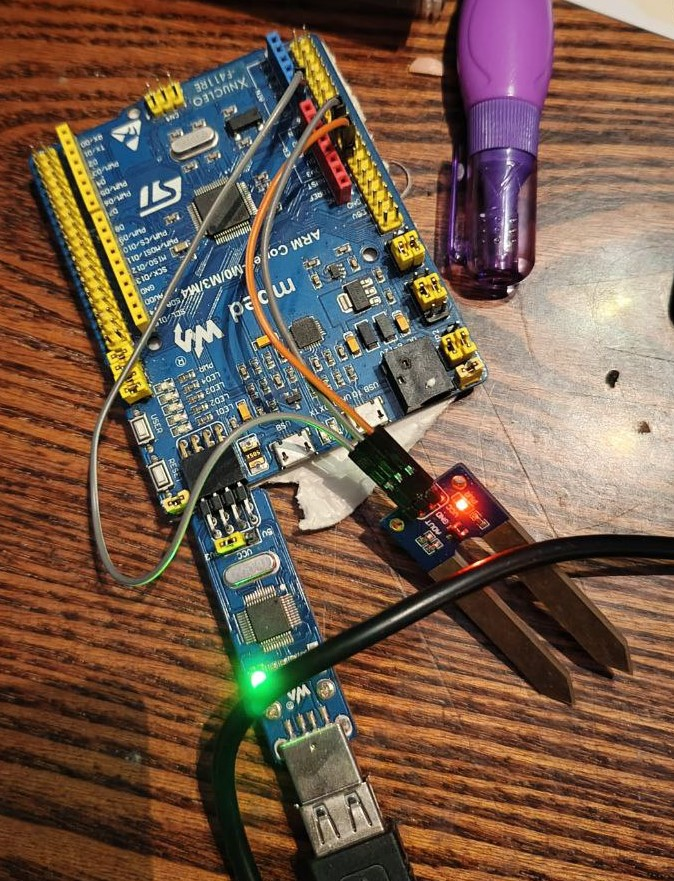
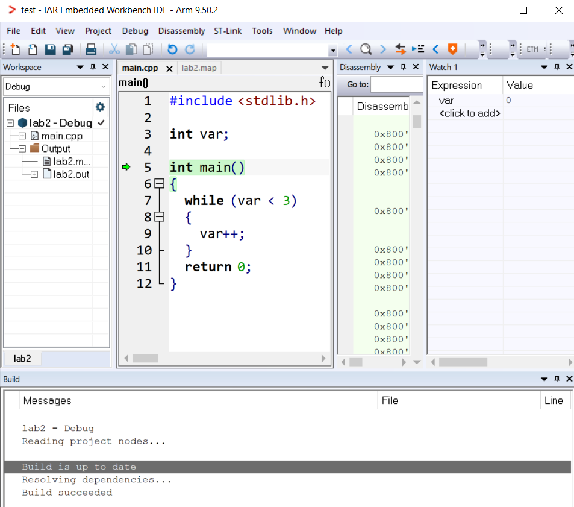

:toc:
:toc-title: Оглавление
= Лабораторная работа №2

Знакомство с IAR Embedded Workbench

include::titul.adoc[]

<<<

== Введение

Цель работы -- описать процесс преобразования текстового файла, содержащего высокоуровневый язык программирования, в машинный.

Задачи: 

* подключить плату STM32F411; +
* проверить работу платы с помощью простого кода.

<<<
== Основная часть 

=== Как микроконтроллер понимает, что делать

Условно при создании программы мы набираем текстовый файл из команд, который потом с помощью определенных действий, от нас не зависящих, понимается микроконтроллером и им выполняется. +

Компилятор обрабатывает текстовый файл следующим образом:

* проверка на синтаксические ошибки (синтаксис языка программирования); +
* проверка семантики (правильность использования операторов языка); +
* формирование объектного файла, содержащего машинный код; +

После в ход идет компоновщик кода (Linker), который:

* выдает всем командам и переменный свой определенный адрес; +
* создает файл ELF, который можно запустить на микроконтроллере.

Файл формата ELF можно загрузить в ROM микроконтроллера, используя программатор. Проводится отладка.

В среде IAR можно наблюдать в реальном времени за происходящими процессами в коде после каждого такта.

=== Перед тем как запустится программа

До выполнения основного тела функции main() микроконтроллер вполняет еще много других действий. Сразу после включения питания микроконтроллера происходит переход к области памяти со следующими инструкциями:

* инициализация указателя стека на конечный адрес стека; +
* инициализация глобальных переменных нулями; +
* инициализация переменных, которым присвоено значение; +
* выполнение тела main().

=== Проверка исправности работы IAR и микроконтроллера

Подключим плату и запустим какой-нибудь код:

Рисунок 1 -- Плата подключена

Рисунок 2 -- Программа запустилась без ошибок

Можно спокойно отслеживать содержание переменной var.

== Вывод

IAR работает исправно, микроконтроллер подключается без ошибок.

Можно пробовать работать дальше.