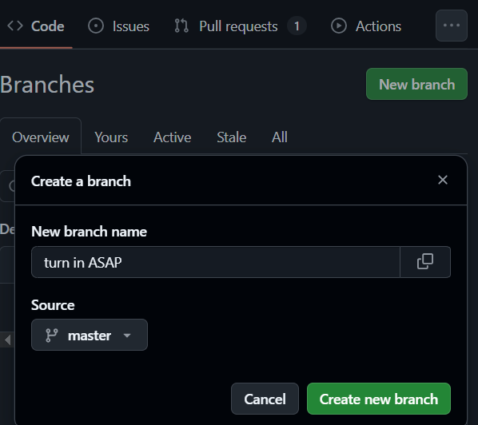
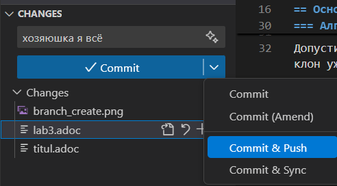
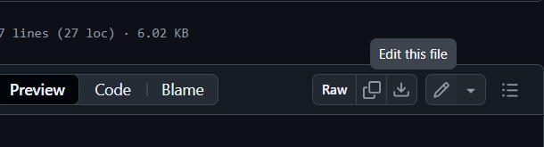

:toc:
:toc-title: Оглавление
= Лабораторная работа №3

Работа с GitHub

include::titul.adoc[]

<<<

== Введение

Цель работы -- описать самые необходимые моменты при совместной работе в GitHub и VS Code.

<<<
== Основная часть 

=== Термины и определения

Перед тем как перейти к описанию алгоритма работы стоит пройтись по основным понятиям:

•  Репозиторий (Repository): Главная папка. Существует локальный (на вашем компьютере) и удаленный репозиторий (на GitHub).
•  Коммит (Commit): Текущая версия документа. Обычно сопровождается описанием этой версии (или внесенных изменений).
•  Ветка (Branch): Позволяет работать над каждым пунктом проекта отдельно, не затрагивая стабильную часть.
•  Слияние (Merge): Процесс объединения изменений из одной ветки в другую.
•  Запрос на слияние (Pull Request, PR): Предложение объединить изменения из вашей ветки в основную (или другую) ветку. PR это центральный механизм для рецензирования кода.
•  Push: Отправка коммита из локального в удаленный репозиторий на GitHub.
•  Pull/Fetch: Загрузка изменений из удаленного репозитория в локальный.

=== Алгоритм

Допустим у нас есть готовый репозиторий и его клон уже присутствует на ПК, а нам нужно срочно отправить отчет по проделанной работе.

Для этого нам нужно <<создать ветку>> на GitHub, придумать ей имя и сохранить. Она появится в списке веток на сайте, а если на вкладке Source Control -> Repositories -> три точки -> Pull, то ветка появится в списке веток VS Code. (Ветка не появилась, потому что я не стала ее создавать, но она появилась бы.)

[#создать ветку]

Рисунок 1 -- Как создать ветку

В локальной ветке на вкладке Explorer в VS Code мы создаем файл(ы) проделываем все необходимые махинации с их наполнением, а потом снова возвращаемся на вкладку Source Control, чтобы залить коммит на GitHub.

Обязательно создать сообщение к коммиту! Теперь можно заливать.

Рисунок 2 -- Как залить всё на Github

Следующий этап -- дать понять проверяющему, что он проверяющий и должен что-то проверить. PR создаем в GitHub.

Для этого на вкладке Pull Requests выбираем New PR, выбираем что хотим ИЗ нашей ветки в главную (main) сравнить изменения (compare changes) и жмем Create Pull request.

Далее выпадает окно, где нужно указать коллаборатора как Reviewer и снова нажать создать PR.

Далее томительно ждем неизбежных правок.

После того как нам отправляют правки можно легко и просто внести их уже на GitHub на вкладке Code и повторно отправить PR (появится 🔃 рядом с именем коллаборатора).

Рисунок 3 -- Как внести правки

Каждый раз стоит уведомлять ревьювера об исправлении правок (например, отвечать на GitHub к комментариям).

Когда все правки оказались одобрены, можно сливать всё содержимое ветки с помощью Squish & Merge в main.

Удаляем ветку, она больше не нужна (даже не надо делать это самостоятельно, GitHub сам предложит ее уничтожить).

== Вывод

Созданный отчет может служить как памятка для собственного использования или, если кто-то обратится за помощью по поводу этой информации, пусть ее и можно узнать у чата GPT.