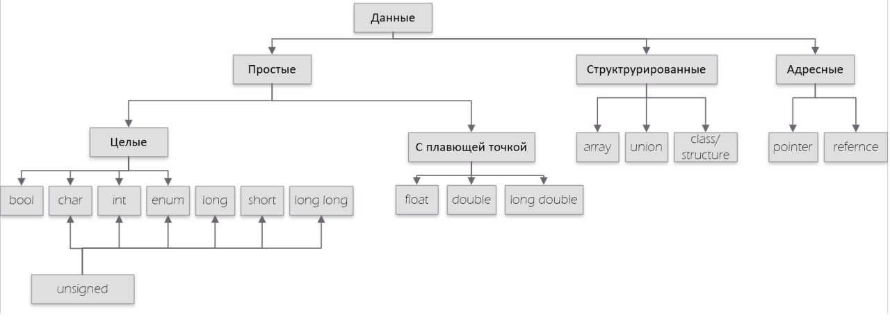
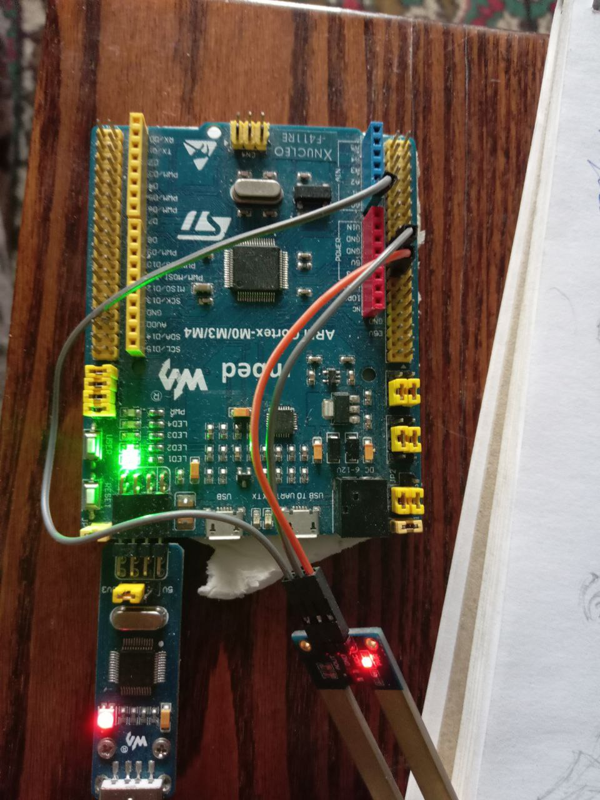
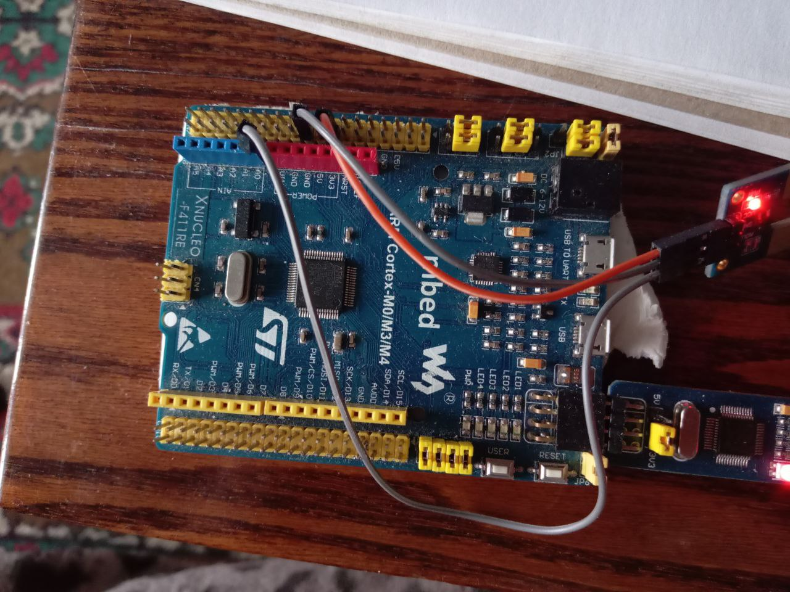

:toc:
:toc-title: Оглавление
:figure-caption: Рисунок
:stem:

= Лабораторная работа №4

Типы данных С++

include::titul.adoc[]

<<<

== Введение

Цель работы -- описать типы данных, преоразвание типов, действия над ссылками и указателями. Что такое регистры.

<<<
== Основная часть 

=== Термины и определения

В общем и целом типы данных подразделяют на три большие группы: 

** простые
** структуривровнанные
** адресные.

Под *простыми* типами данных будем понимать все те типы, которые могут содержать в себе числа или/и символы.

Простые так же можно рассматривать по следующим категориям:

** *целые* и *с плавающей запятой*
** *знаковые* и *беззнаковые*

*Структурированных* типов данных всего 3 -- массив, класс, объединение

*Адресных* типов данных различают 2:

**ссылка (reference)
**указатель (pointer)

.Типы данных

=== Размеры типов данных

Размеры типов не четко определены и могут отличаться для различных микроконтроллеров. Для размеров типов существует правило:

[.source, cpp]
----
1             <= sizeof(char)     <= sizeof(short) <= sizeof(int) <= sizeof(long)
1             <= sizeof(bool)     <= sizeof(long)
sizeof(char)  <= sizeof(long)
sizeof(float) <= sizeof(double)   <= sizeof(long double)
sizeof(T)     == sizeof(signed T) == sizeof(unsigned T)
----

Следует явно указывать размер типа данных при создании переменной.

[.source, cpp]
----
uint32_t test; // явно int четырехбайтный
uint8_t test; // явно int двухбайтный
----

=== Преобразование типов

Иногда требуется присвоить значение одной переменной другой.

Специально для близких типов существует оператор *static_cast*.

[.source, cpp]
----
int a = static_cast<int>(0); # <1>

int a = static_cast<int>(3.14);  # <2>
----

[.notes]
--

<1> Явно говорим, что 0 должен восприниматься как тип (int), хотя он и так является литералом типа int;

<2> Явно говорим, что 3.14 воспринимать как int, т.е взять только целую часть;
--

Под близкими типами подразумеваеются простые типы, пользовательские типы и т.д.

Бывает иногда так, что требуется привести разные типы.

Например, часто при работе с указателями мы пользуемся адресами ячеек памяти.

Но ячейка памяти -- просто набор цифр, практически идентификатор типа int. Для *явного преобразования* используем оператор reinterpret_cast.

[.source, cpp]
----
std::uint32_t* const gpiocOdrPtr = reinterpret_cast<std::uint32_t*>(0x40020814);
----

Теперь тип int явно приведен к адресному типу.

=== Операции над указателями и ссылками

Сразу скажем, что практически никакие действия над *ссылками* мы применять не можем. 

** не можем их складывать
** не можем изменять
** ссылка должна быть проинициализирована

С указателями все интереснее -- их можно складывать, сравнивать, узнавать значение по адресу (который он хранит, *разыменовывать*).

[.source, cpp]
----
int a = 4;
int* ptr = &a; // присвоили адрес а
*ptr++; // разыменовали, увеличили значение а (теперь а = 5)
ptr++; // изменили значение ptr
----

=== Регистры

Регистры - это быстрая память внутри процессора. Они хранят данные, с которыми процессор работает прямо сейчас. Если представлять процессор как мозг компьютера, то регистры - это его кратковременная память.

Вот главные особенности регистров:

* Они очень маленькие по объему - обычно могут хранить 32 или 64 бита, то есть 4 или 8 байт (в нашем случае 4 байта);

* Регистры сразу доступны процессору, что дает сверхбыструю работу;

* Их число ограничено - в разных процессорах разное количество регистров.

Виды:

* *Регистры общего назначения* - сюда помещают данные или результаты вычислений;

* *Регистры специальных функций* - они управляют процессом работы процессора, например, текущее состояние, куда переходить дальше и т.п.

* *Регистры специального назначения* - регистры, имеющие свой адрес и имеющие отдельные поля, отвечающие за работу переферии (например, регистр CR, управляющий таймером, и его поле CEN, отвечающий за включение/выключение таймера).

Регистры - это рабочий стол процессора, где хранятся инструменты и материалы, с которыми процессор работает прямо сейчас.

== Код

[.source, cpp]
----
#include <iostream> // for std:: cout
#include "rccregisters.hpp" // for RCC
#include "gpioaregisters.hpp" // for GPIOA
#include "gpiocregisters.hpp" // for GPION

std::uint32_t SystemCoreClock = 16'000'000U;

extern "C" {
int __low_level_init(void)
{
  //Switch on external 16 MHz oscillator
  RCC::CR::HSION::On::Set();
  while (RCC::CR::HSIRDY::NotReady::IsSet())
  {

  }
  //Switch system clock on external oscillator
  RCC::CFGR::SW::Hsi::Set();
  while (!RCC::CFGR::SWS::Hsi::IsSet())
  {

  }
  
  RCC::APB2ENR::SYSCFGEN::Enable::Set();

  return 1;
}
}

void delay(int cycles)
{
  for(int i = 0; i < cycles; ++i)    
  {
    asm volatile("");
  }    
}

int main()
{  

  //0x4002 0810
  RCC::AHB1ENR::GPIOAEN::Enable::Set() ;
  RCC::AHB1ENR::GPIOCEN::Enable::Set() ;
  GPIOA::MODER::MODER5::Output::Set() ;
  GPIOC::MODER::MODER5::Output::Set() ;
  GPIOC::MODER::MODER8::Output::Set() ;
  GPIOC::MODER::MODER9::Output::Set() ;
  bool flag = false;
  for(;;)
  {
    
   std::uint32_t* const gpiocOdrPtr = reinterpret_cast<std::uint32_t*>(0x40020814); //1
   std::uint32_t* const gpiocIdrPtr = reinterpret_cast<std::uint32_t*>(0x40020810); //2
   auto volatile idrValue= *gpiocIdrPtr;
   bool isButtonPressed = ((idrValue & (1<<13))==0); //3
   if (isButtonPressed)
   {
     *gpiocOdrPtr^= (1<<5); //4
   }

     delay(1000000);
     
   }
  
  return 1;
}
----
Комментарии к коду

1. явно преобразуем значение адреса регистра диода к адресному типу
2. явно преобразуем значение адреса регистра кнопки к адресному типу
3. создаем булеву переменную, которая будет отображать когда кнопка нажата
4. Описание: если кнопка нажата, поменять бит номер 5 (отвечает за диод) в противоположное значение

.Кнопка нажата 1 раз

.Кнопка нажата 2 раз

== Вывод

Язык С++ предлагает работу с большим количеством типов данных. В этой работе были описаны некоторые типы данных, явное преобразование между типами данных. Так же были описаны некоторые регистры.
