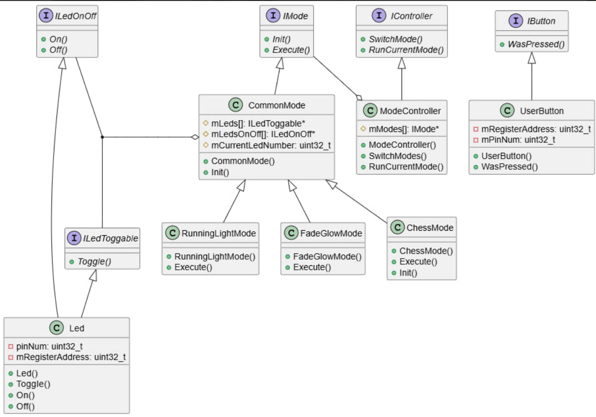

:toc:
:toc-title: Оглавление
:figure-caption: Рисунок
:stem:

= Лабораторная работа №5

Разработка программы

include::titul.adoc[]

<<<

== Введение

Цель работы: демонстрация полученных знаний в процессе разработки и реализации архитектуры программы -- гирлянда с режимами.

Задачи:

* описание полученных интерфейсов
* выявление наличия уже существующих паттернов в созданной архитектуре

== Описание архитектуры

=== Начало

Все началось с простого задания -- создать программу, которая позволит по кнопке включать и выключать диоды на плате.

Мы посмотрели, почесали голову и пошли искать к каким адресам памяти подсоединены кнопка и диоды.

Адрес одного диода и кнопки мы уже знали (см. lab4.adoc), найти остальные было несложно.

Недолго думая, мы пришли к созданию следующего кода:

[.sourse, cpp]
----
#include "iostream"//for std::cout
#include "rccregisters.hpp" // for RCC
#include "gpioaregisters.hpp" // for GPIOA
#include "gpiocregisters.hpp" // for GPIOÑ

std::uint32_t SystemCoreClock = 16'000'000U;

extern "C" {
int __low_level_init(void)
{
  //Switch on external 16 MHz oscillator
  RCC::CR::HSION::On::Set();
  while (RCC::CR::HSIRDY::NotReady::IsSet())
  {

  }
  //Switch system clock on external oscillator
  RCC::CFGR::SW::Hsi::Set();
  while (!RCC::CFGR::SWS::Hsi::IsSet())
  {

  }
  
  RCC::APB2ENR::SYSCFGEN::Enable::Set();

  return 1;
}
}

void delay(int cycles)
{
  for(int i = 0; i < cycles; ++i)    
  {
    asm volatile("");
  }    
}

int main()
{ 
  RCC::AHB1ENR::GPIOAEN::Enable::Set() ;

  RCC::AHB1ENR::GPIOCEN::Enable::Set() ;

  GPIOA::MODER::MODER5::Output::Set() ;
 
  GPIOC::MODER::MODER5::Output::Set() ;
  GPIOC::MODER::MODER8::Output::Set() ;
  GPIOC::MODER::MODER9::Output::Set() ;
  uint32_t i = 0;
  uint32_t stage = 0;
  for(;;)
  { 
   std::uint32_t* const gpiocOdrPtr = reinterpret_cast<std::uint32_t*>(0x40020814U);
   std::uint32_t* const gpioaOdrPtr = reinterpret_cast<std::uint32_t*>(0x40020014U);
   std::uint32_t* const gpiocIdrPtr = reinterpret_cast<std::uint32_t*>(0x40020810U);
   auto volatile idrValue= *gpiocIdrPtr;
   bool isButtonPressed = ((idrValue & (1<<13))==0);
   
   *gpiocOdrPtr|= (1<<i);
  switch (stage)
  {
  case 0:
    {
      i=5; 
      break;
    }  
  case 1: 
    {
      i=8; 
      break;
    }  
  case 2: 
    {
      i=9; 
      break;
    }
  case 3: 
    {
      *gpioaOdrPtr |= (1<<5); 
      break;
    }
  case 4: 
    {
      *gpiocOdrPtr &=~ ((1<<5)|(1<<8)|(1<<9)); 
      *gpioaOdrPtr &=~ (1<<5); 
      break;
    }
  }
  if(isButtonPressed)
    {
      stage++;
      stage %= 5;
    }
  }
  return 1;
}
----

*Описание кода*

Если коротко -- с помощью switch(case) мы прописали события (5 штук по очереди включающие диоды, а пятый выключает все). По кнопке событие меняется и, дойдя до последнего, снова переключается на первое событие.

Возник закономерный вопрос -- а если диодов будет больше? Так же менять все свитчкейсы? Нет, слишком тяжело, такого не хотим.

Что тогда? Надо подумать.

=== Изобретение велосипеда

В первую очередь мы начали изобретать как бы так сделать, чтобы по итогу нам поменьше вносить изменения, если придется таковые вносить.

На рамышление предлагались категории:

* Диоды
* Кнопка
* Возможные режимы

Размышляя над *диодами* мы думали -- если придется работать с однотипными структурами, то им просто нужно *создать общий класс*! Все диоды имеют общие черты: адрес и номер пина, к которому они подключены. Так же они имеют только два режима: потух или горит.

Так как "потух или погас" -- абсолютно одинаковое свойство для всех диодов (адрес и пин могут быть разными), мы вынесли этот метод как интерфейс, а объекты именно диодов будут создаваться от класса-наследника.

*Кнопок* тоже может быть много -- для него был тоже создан интерфейс и класс-наследник, его реализующий. Кнопка может быть только нажата или не нажата.

*Режимы* оказались чуть более сложной задачей -- в итерационном процессе создания проекта понадобилось создать несколько режимов, требующих от ранее созданных классов методы, которые они не содержат.

Мы так же заметили, что созданные нами режимы очень походят на шаблон проектирования *strategy* (стратегия), и начали действовать более уверенно.

== Описание кода

=== Как же работает код

Мы постарались и смогли усовершенствовать наш код до хорошего уровня. Он претерпел много исправлений и перестроений, но он родился.

Имеем 4 группы классов (интерфейсы с классами реализации):

* диоды (ILedToggable, ILedOnOff; Led, OptimizedLed)
* кнопка (IButton; UserButton)
* режимы (IMode; CommonMode, RunningLightMode, ChessMode, GlowFadeMode)
* управление режимами (IController; ModeController)

Буквально имеем:

1. Создаем столько *диодов* сколько нужно (с помощью адреса и пина), добавляем его в 2 массива диодов.
2. *Режимов* всего 3 -- шахматка, включить/выключить, бегущий огонь. При создании объекта режимов на вход задаем 2 массива.
3. Для *кнопки*, как и для диода, на вход задаются адрес и номер пина. По кнопке переключаются режимы.
4. Группа *управление режимами* позволяет упростить смену режима, он не зависит от количества режимов.

=== Что стоило бы улучшить/не допускать в будущем

Как уже стало понятно, следует сначала думать, а только ПОТОМ ДЕЛАТЬ.

1. Получилось бы избежать многих проблем -- не пришлось бы создавать дополнительный интерфейс только для функций включения/выключения (в соответствии с принципом SOLID).

2. Не самое важное, но не менее значимое -- сразу создавать отдельные файлы для каждого класса. Это бы заняло меньше времени в конечном счете.

3. И, наконец, диоды можно было бы создавать с помощью шаблонов, а не классов, что могло бы значительно уменьшить память, отводящуюся под их хранение. В конечный код этот метод не вошел, но был рассмотрен как более предпочтительный.

== Приложение

=== UML диаграмма

=== Полный код программы

[source,cpp]
----
#include "iostream"//for std::cout
#include "rccregisters.hpp" // for RCC
#include "gpioaregisters.hpp" // for GPIOA
#include "gpiocregisters.hpp" // for GPIO�
#include <array>// for std::array
#include "UserButton.h" // for IButton, UserButton
#include "ModeController.h" // for IController, ModeController
#include "ModeConfig.h" // for modes

std::uint32_t SystemCoreClock = 16'000'000U;

extern "C" {
int __low_level_init(void)
{
  //Switch on external 16 MHz oscillator
  RCC::CR::HSION::On::Set();
  while (RCC::CR::HSIRDY::NotReady::IsSet())
  {

  }
  //Switch system clock on external oscillator
  RCC::CFGR::SW::Hsi::Set();
  while (!RCC::CFGR::SWS::Hsi::IsSet())
  {

  }
  
  RCC::APB2ENR::SYSCFGEN::Enable::Set();

  return 1;
}
}

void delay(int cycles)
{
  for(int i = 0; i < cycles; ++i)    
  {
    asm volatile("");
  }    
}

constexpr std::uint32_t buttonPinNum = 13;
constexpr std::uint32_t portCIdrAddress = 0x40020810U;
UserButton userButton(buttonPinNum, portCIdrAddress);

ModeController modeController(modes);

int main()
{ 
  //������ ������������ �� ���� �
  RCC::AHB1ENR::GPIOAEN::Enable::Set() ;
  //������ ������������ �� ���� �
  RCC::AHB1ENR::GPIOCEN::Enable::Set() ;
  //����� �.5 �� �����
  GPIOA::MODER::MODER5::Output::Set() ;
  //����� C.5,C.8, C.9 �� �����
  GPIOC::MODER::MODER5::Output::Set() ;
  GPIOC::MODER::MODER8::Output::Set() ;
  GPIOC::MODER::MODER9::Output::Set() ;
  
  for(;;)
  {   
    
    if (userButton.WasPressed())
    {
      modeController.SwitchMode(); 
    }
    delay(500000);
    modeController.RunCurrentMode(); 

  }
  return 1;
}

----

=== IButton.h

[source,cpp]
----
#if !defined(IBUTTON_H)
#define IBUTTON_H

class IButton
{
public:
  virtual bool WasPressed() const = 0;
};

#endif
----

=== UserButton.cpp

[source,cpp]
----
#include "UserButton.h"
#include <cassert>

UserButton::UserButton(std::uint32_t pinNum, std::uint32_t registerAddress):
    mPinNum(pinNum),
    mRegisterAddress(registerAddress)
    {
    
    }
bool UserButton::WasPressed() const
{
  bool isButtonPressed = ((*reinterpret_cast<std::uint32_t*>(mRegisterAddress) & (1 << mPinNum)) == 0);
  return isButtonPressed;
}
----

=== UserButton.h

[source,cpp]
----
#if !defined(USERBUTTON_H)
#define USERBUTTON_H
#include "IButton.h" // for IButton
#include "cstdint" // for uint32_t

class UserButton : public IButton
{
public:
  UserButton(std::uint32_t pinNum, std::uint32_t registerAddress);
  bool WasPressed() const override;
private:
  std::uint32_t mRegisterAddress;
  std::uint32_t mPinNum;
};

#endif
----

=== IController.h

[source,cpp]
----
#if !defined(ICONTROLLER_H)
#define ICONTROLLER_H

class IController
{
public:
  virtual void SwitchMode() = 0;
  virtual void RunCurrentMode() = 0;
};

#endif
----

=== ModeController.cpp

[source,cpp]
----
#include "ModeController.h"
#include "IMode.h"
#include <cassert>
#include "IController.h" // for IController
#include "ILedToggable.h" // for ILedToggable
#include "ILedOnOff.h" // for ILedOnOff
#include "LedConfig.h"

ModeController::ModeController(const tModes& modes):
    mModes(modes),
    mCurrentMode(0)
    {
      
    }
    void ModeController::SwitchMode() 
{
  mCurrentMode++;
    if (mCurrentMode == std::size(mModes))
    {
      mCurrentMode = 0;
    }
    mModes[mCurrentMode]->Init();
}
void ModeController::RunCurrentMode() 
{
  mModes[mCurrentMode]->Execute();
}
----

=== ModeController.h

[source,cpp]
----
#if !defined(MODECONTROLLER_H)
#define MODECONTROLLER_H
#include "IController.h" // for IController
#include "IMode.h"
#include <cstdint> // for std::uint32_t
#include "ModeConfig.h"// for tModes

class ModeController: public IController
{
public:
  ModeController(const tModes& modes);
    void SwitchMode() override;
    void RunCurrentMode() override;
private:
  const tModes mModes;
  std::uint32_t mCurrentMode;
};

#endif
----

=== ILedOnOff.h

[source,cpp]
----
#if !defined(ILEDTONOFF_H)
#define ILEDTONOFF_H
#include <array>// for std::array

class ILedOnOff 
{
public:
  virtual void On() const = 0;
  virtual void Off() const = 0;
};

#endif // ILEDTONOFF_H
----

=== ILedToggable.h

[source,cpp]
----
#if !defined(ILEDTOGGABLE_H)
#define ILEDTOGGABLE_H
#include <cstdint> // for std::uint32_t
#include <array>// for std::array

class ILedToggable
{
  public:
    virtual void Toggle() const = 0;  //virtual method for using
};

#endif // ILEDTOGGABLE_H
----

=== Led.cpp

[source,cpp]
----
#include "Led.h"
#include <cassert>

Led::Led(std::uint32_t pinNum, std::uint32_t registerAddress): //its own method
      mPinNum(pinNum), // number of pin
      mRegisterPtr(reinterpret_cast<std::uint32_t*>(registerAddress)) //address of pins
    {
      
    }
    
    void Led::Toggle() const 
    {
      assert(mPinNum <= 15);
      *mRegisterPtr ^= (1 << mPinNum); //switches on and of using number of pin
    }
    
    void Led::On () const 
    {
      *mRegisterPtr |= (1 << mPinNum);
    }
    void Led::Off () const 
    {
      *mRegisterPtr &= ~(1 << mPinNum);
    }
----

=== Led.h

[source,cpp]
----
#if !defined(LED_H)
#define LED_H
#include "ILedToggable.h" // for ILedToggable
#include "ILedOnOff.h" // for ILedOnOff
#include <cstdint> // for std::uint32_t

class Led: public ILedToggable, public ILedOnOff //child class
  {
  public:
    Led(std::uint32_t pinNum, std::uint32_t registerAddress); //its own method
    void Toggle() const override; 
    void On () const override;
    void Off () const override;
  private:
    std::uint32_t mPinNum;
    std::uint32_t* const mRegisterPtr;
    
  };
  #endif // LED_H
----

=== OptimizedLed.h

[source,cpp]
----
#if !defined(OPTIMIZEDLED_H)
#define OPTIMIZEDLED_H
#include "ILedToggable.h" // for ILedToggable
#include "ILedOnOff.h" // for ILedOnOff
#include <cstdint> // for std::uint32_t

template <std::uint32_t registerAddress, std::uint32_t pinNum>
class OptimizedLed: public ILedToggable, public ILedOnOff //child class
{
public:
  void Toggle() const override
  {
    static_assert(pinNum <= 15, "????? ???? ?? ????? ???? ?????? 15");
    auto const ptrRegister = reinterpret_cast<volatile std::uint32_t*>(registerAddress);
    *ptrRegister ^= (1U << pinNum);
  }
  void On () const override
  {
    static_assert(pinNum <= 15, "????? ???? ?? ????? ???? ?????? 15");
    auto const ptrRegister = reinterpret_cast<volatile std::uint32_t*>(registerAddress);
    *ptrRegister |= (1U << pinNum);
  }
  void Off () const override
  {
    static_assert(pinNum <= 15, "????? ???? ?? ????? ???? ?????? 15");
    auto const ptrRegister = reinterpret_cast<volatile std::uint32_t*>(registerAddress);
    *ptrRegister &= ~(1U << pinNum);
  }
};
#endif // OPTIMIZEDLED_H

----

=== ChessMode.cpp

[source,cpp]
----
#include "ChessMode.h"
#include <cassert>
#include "ILedToggable.h" // for ILedToggable
#include "ILedOnOff.h" // for ILedOnOff

ChessMode::ChessMode(const tLeds& leds, const tLedsOnOff& ledsOnOff):
  CommonMode(leds, ledsOnOff)
    {
      
    }
void ChessMode::Init()
  {
    mCurrentLedNumber = 0;
    for (auto it: mLedsOnOff)
    {
      mCurrentLedNumber++;
      (mCurrentLedNumber % 2 == 0) ? it->Off() : it->On(); //тернарная операция
    }
  }
void ChessMode::Execute()
  {
    mCurrentLedNumber = 0;
    for(auto it: mLeds)
    {
      mLeds[mCurrentLedNumber++]->Toggle();
      if (mCurrentLedNumber == std::size(mLeds))
      {
        mCurrentLedNumber = 0;
      }
    }
  }
----

=== ChessMode.h

[source,cpp]
----
#if !defined(CHESSMODE_H)
#define CHESSMODE_H
#include "CommonMode.h"
#include "ILedToggable.h" // for ILedToggable
#include "ILedOnOff.h" // for ILedOnOff
#include "LedConfig.h" // for tLeds, for tLedsOnOff

class ChessMode : public CommonMode // MODE 3
{
public:
  ChessMode(const tLeds& leds, const tLedsOnOff& ledsOnOff);
  void Init() override;
  void Execute() override;
};

#endif
----

=== CommonMode.cpp

[source,cpp]
----
#include "CommonMode.h"
#include "Led.h"
#include <cassert>
#include "ILedToggable.h" // for ILedToggable
#include "ILedOnOff.h" // for ILedOnOff

CommonMode::CommonMode(const tLeds& leds, const tLedsOnOff& ledsOnOff):
    mLeds(leds),
    mLedsOnOff(ledsOnOff),
    mCurrentLedNumber(0)
    {
      
    }
void CommonMode::Init()
    {
      mCurrentLedNumber = 0;
      for (auto it: mLedsOnOff)
      {
        it->Off();
      }
    }
----

=== CommonMode.h

[source,cpp]
----
#if !defined(COMMONMODE_H)
#define COMMONMODE_H
#include "IMode.h" //for IMode
#include <cstdint> //for std::uint32_t
#include "ILedToggable.h" // for ILedToggable
#include "ILedOnOff.h" // for ILedOnOff
#include "LedConfig.h" // for tLeds, for tLedsOnOff

class CommonMode: public IMode
{
public:
  CommonMode(const tLeds& leds, const tLedsOnOff& ledsOnOff);
  void Init() override;
protected:
  const tLeds& mLeds;
  const tLedsOnOff& mLedsOnOff; 
  std::uint32_t mCurrentLedNumber;
};
#endif
----

=== FadeGlowMode.cpp

[source,cpp]
----
#include "FadeGlowMode.h"
#include <cassert>
#include "ILedToggable.h" // for ILedToggable
#include "ILedOnOff.h" // for ILedOnOff

FadeGlowMode::FadeGlowMode(const tLeds& leds, const tLedsOnOff& ledsOnOff):
CommonMode(leds, ledsOnOff)
    {
      
    }
    
void FadeGlowMode::Execute()
{
  for(auto it: mLeds)
  {
    it->Toggable();
  }
}
----

=== FadeGlowMode.h

[source,cpp]
----
#if !defined(FADEGLOWMODE_H)
#define FADEGLOWMODE_H
#include "CommonMode.h"
#include "ILedToggable.h" // for leds
#include "ILedOnOff.h" // for ledsOnOff
#include "LedConfig.h" // for tLeds, for tLedsOnOff

class FadeGlowMode : public CommonMode // MODE 2
{
public:
  FadeGlowMode(const tLeds& leds, const tLedsOnOff& ledsOnOff);
  void Execute() override;
};

#endif
----

=== RunningLightMode.cpp

[source,cpp]
----
#include <cassert>
#include "RunningLightMode.h"
#include "ILedToggable.h" // for ILedToggable
#include "ILedOnOff.h" // for ILedOnOff

RunningLightMode::RunningLightMode(const tLeds& leds, const tLedsOnOff& ledsOnOff):
    CommonMode(leds, ledsOnOff)
    {
      
    }
void RunningLightMode::RunningLightMode::Execute()
    {
      mLeds[mCurrentLedNumber++]->Toggle();
      if (mCurrentLedNumber == std::size(mLeds))
      {
        mCurrentLedNumber = 0;
      }
    }
  

----

=== RunningLightMode.h

[source,cpp]
----
#if !defined(RUNNINGLIGHTMODE_H)
#define RUNNINGLIGHTMODE_H
#include "CommonMode.h"
#include "ILedToggable.h" // for ILedToggable
#include "ILedOnOff.h" // for ILedOnOff
#include "LedConfig.h" // for tLeds, tLedsOnOff

class RunningLightMode : public CommonMode // MODE 1
{
public:
  RunningLightMode(const tLeds& leds, const tLedsOnOff& ledsOnOff);
  void Execute() override;
};

#endif
----

Скачать папку можно https://github.com/DolgihE/New2/tree/0f78a93e1dcf90bf932390115210370eea640a9b/girlyanda[здесь].

== Заключение

Работа над проектом была очень поучительным опытом не только в области следования общепринятым правиам и их зубрежки, но и почему эти правила очень нужные и облегчают жизнь.
