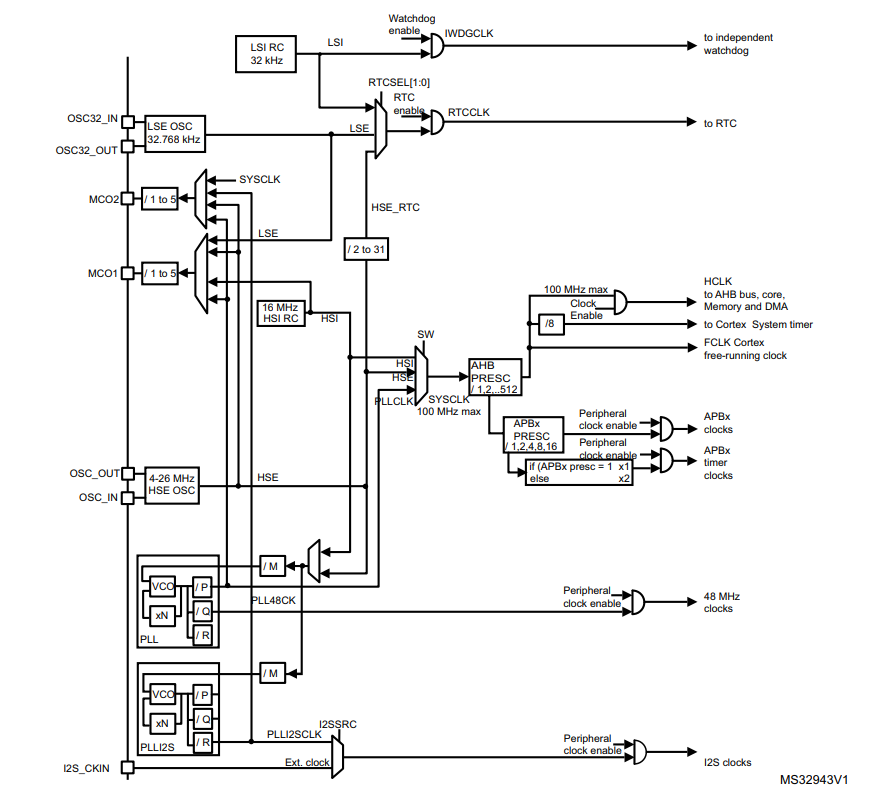
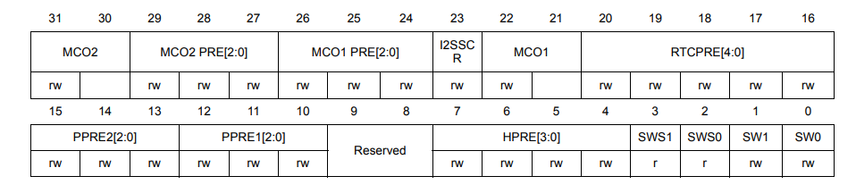
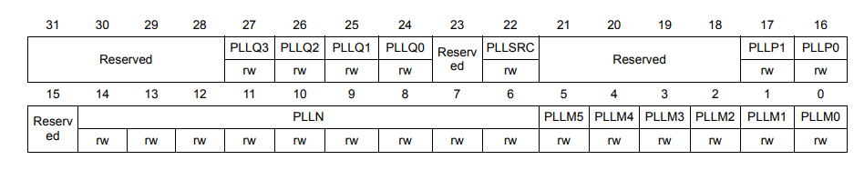

:toc:
:toc-title: Оглавление
:figure-caption: Рисунок
:table-caption: Таблица
:stem:
= Лабораторная работа №6

Таймеры и системы тактирования. Порты

[.text-right]
Автор работы: Студент группы КЭ-413 +
Е.В. Долгих 

<<<
== Введение

Цель работы: провести настройку таймера 2.

Задачи работы:

* Описать работу основной переферии микроконтроллера: порты, таймеры, источники тактирования.
* Привести примеры настройки описанных элементов.
* Сделать выводы о функционировании кнопки.

<<<
== Источники частоты 

=== Общие сведения

Модуль тактирования состоит из 5 видов источников тактирования:

1. 2 основных и 1 производный. Они отвечают за формирование системной тактовой частоты SYSCLK:

* HSI (high-speed internal) -- внутренний высокочастотный; 
* HSE (high-speed external) -- внешний высокочастотный; 
* PLL (phase-locked loop) -- фазовая автоподстройка частоты, ФАПЧ. 

2. и 2 вторичных:

* LSI (low-speed internal) -- внутренний низкочастотный; 
* LSE (low-speed external) -- внешний низкочастотный.

От LSE с частотой 32.768 кГц как раз можно создать часы.

Строго говоря, ФАПЧ (PLL) не самостоятельный источник, а является лишь системой из умножителей и делителей, модифицирующих HSE и HSI сигналы (см. рисунок 1).

.Тактовое дерево

=== Настройка 

Настройка первичных источников тактирования затрагивает 3 основных регистра: 

* RCC_CR; 
* RCC_CFGR;
* RCC_PPLLCFGR.

Включение источников тактирования выполняется через регистр *CR* (Clock Control register). В этом же регистре располагаются биты проверки работы источников, т.е. существует задержка между командой "включить" и ответом "включен" от системы.

.Регистр CR
image::rcc_cr.png[]
.Контроль работы
|===
||PLL|HSE|HSI
|RDY|Bit [25]|Bit [17]|Bit [1]
|ON|Bit [24]|Bit [16]|Bit [0]
|===

*Чтобы включить источник, следует установить 1 в бит ON. Чтобы выключить -- 0.* 

Дальнейшие действия могут происходить только после того как в бит _RDY_ аппаратно установился бит 1. Иначе источник не готов к работе (стоит 0).

Далее идет переключение работы системной частоты SYSCLK с одного источника на другой. Это делается через регистр *CFGR*.

.Регистр CFGR

С рисунка 3 нам нужны 4 младших бита -- SW (switch) и SWS (switch status).

SW отвечает за выбор источника (программно), а SWS за подтверждение переключения на нужный источник (устанавливается аппаратно).

Допустимые значения для этих полей:

* 00 -- включен HSI
* 01 -- включен HSE
* 10 -- включен PLL

Так же, как и при включении источников, для дальнейшей работы требуется сначала проверить *установлен ли SWS в тот же режим, что и SW*.

Для настройки делителей/умножителей PLL существует отдельный регистр PLLCFGR. *Его следует настроить в первую очередь перед запуском PLL*.

.Регистр PLLCFGR

Можно подобрать почти любую частоту до 100 МГц, подбирая и записывая значения делителей/умножителей по следующей формуле:

====
f = f(PLL clock input) × (PLLN / PLLM) /PLLP​
====

Следует аккуратно подбирать эти значения, так как в документации на микроконтроллер есть ограничения на сами коэффициенты и на некоторые промежуточные значения (например, после блока VCO на рисунке 1 частота должна находиться в диапазоне от 100 до 432 МГц).

=== Примеры настройки

*Настройка HSE*

[source, cpp]
----
  RCC::CR::HSEON::On::Set(); // <1>
  while (RCC::CR::HSERDY::NotReady::IsSet()) // <2> 
  {

  }
  RCC::CFGR::SW::Hse::Set(); //<3>
  while (!RCC::CFGR::SWS::Hse::IsSet())//<4>
  {

  }
  RCC::CR::HSION::Off::Set(); //<5> 
----

<1> включили
<2> проверили включение
<3> перекинули ключ SW на HSE
<4> проверили, что ключ переключился
<5> отключили HSI

*Настройка PLL на 36 МГц на основе HSE*

[source, cpp]
----
  RCC::PLLCFGR::PLLSRC::HseSource::Set(); //1
  
  RCC::PLLCFGR::PLLN0::Set(64); // n = 64
  RCC::PLLCFGR::PLLP0::Set(3); // p = 8
  RCC::PLLCFGR::FieldValues::Set(2); // m = 2
  //2
 RCC::CR::PLLON::On::Set(); //3
  while (RCC::CR::PLLRDY::Unclocked::IsSet()) //4
  {

  }
  RCC::CFGR::SW::Pll::Set(); //5
  while (!RCC::CFGR::SWS::Pll::IsSet()) //6
  {

  }
----

1. настроили источник ФАПЧ на HSE
2. определили коэффициенты 
3. включили
4. проверили, что включили
5. перевели SW на PLL
6. проверили, что перевели

== Таймеры

=== Системный таймер

Самый простой таймер для настройки. Характеристики:

* 24-битный таймер.
* 3 регистра для настройки:
** LOAD -- устанавливает количество отсчетов, с которого будет отсчитывать таймер.
** VAL -- хранит текущее значение отсчета.
** CTRL -- регистр режима работы. С его помощью можно определить источник тактирования и включить/выключить таймер.

=== Таймер TIM2

32-битный таймер общего назначения (как и TIM5).

Всего 5 регистров, им управляющих:

* PSC -- делитель частоты. Позволяет счетчику переполняться медленнее.
* ARR -- autoreload register. Позволяет задать произвольное время переполнения таймера.
* СNT -- регистр, хранящий текущее значение счетчика.
* SR::UIF -- регистр, хранящий бит флага вызова прерывания (например, переполнение или обнуление).
* CR1::CEN -- регистр, хранящий бит включения/выключения таймера.

=== Примеры настройки

СИСТЕМНЫЙ ТАЙМЕР

[source, cpp]
----
#include "stkregisters.h" // для системного таймера

std::uint32_t SystemCoreClock = 16000000U;
std::uint32_t ticks = SystemCoreClock/1000U-1U; // 1
extern "C" {
int __low_level_init(void)
{
  STK::LOAD::RELOAD::Set(ticks); // 2
  STK::VAL::Write(0); //3
  STK::CTRL::CLKSOURCE::Set(0); //4
  STK::CTRL::ENABLE::Enable::Set(); // 5
  
  RCC::APB2ENR::SYSCFGEN::Enable::Set();

  return 1;
}
}
////////////////////////////////////////
int main()
{ 
  /////////////////////////////////////
  for(;;)
  {   
    if (userButton.WasPressed())
    {
      modeController.SwitchMode(); 
    }
    if (STK::CTRL::COUNTFLAG::Overflow::IsSet()) // 6
    {
      modeController.RunCurrentMode(); 
    }
  }
  return 1;
}
----

1. Определяем задержку
2. Устанавливаем задержку на 1 мс
3. Сбрасываем текущее значение
4. Устанавливаем HSI как источник тактирования (он и по умолчанию 0, но для наглядности)
5. Включаем
6. Проверяем флаг на переполнение
7. Радуемся, что все работает и что мы избавились от delay() (см. рис. 5)

.Все работает
//image::timer_syst.gif[]

ТАЙМЕР TIM2

[source, cpp]
----
#include "tim2registers.hpp" // for tim2

extern "C" {
int __low_level_init(void)
{
  RCC::APB1ENR::TIM2EN::Enable::Set(); // подаем тактирование
  TIM2::PSC::Set(0); // устанавливаем делитель частоты в 0
  TIM2::ARR::Write(99'999); // записываем значение для задержки в 1 мс
  TIM2::SR::UIF::Set(0); // сбрасываем флаг генерации прерывания
  TIM2::CNT::Set(0); // сбрасываем счетчик в 0
  TIM2::CR1::CEN::Set(1); // запускаем таймер

  RCC::APB2ENR::SYSCFGEN::Enable::Set();

  return 1;
}
}
////////////////////////////////////
int main()
{ 
 /////////////////////////////////
  
  for(;;)
  { 
    if (userButton.WasPressed())
    {
      modeController.SwitchMode(); 
    }
    if (TIM2::SR::UIF::InterruptPending::IsSet()) // если пришло прерывание
    {
      TIM2::CR1::CEN::Set(0); //останавливаем таймер
      TIM2::SR::UIF::Set(0); // сбрасываем флаг прерывания
      TIM2::CNT::Set(0); // устанавливаем счетчик в 0
      modeController.RunCurrentMode();
      TIM2::CR1::CEN::Set(1); //снова включаем таймер
    }
  }
  return 1;
}
----

== Немного про порты общего назначения

=== Базовая информация

На исследуемом микроконтроллере есть 5 типов портов, содержащих по 16 линий ввода/вывода.

Поддерживаются следующие режимы входа:

* плавающий цифровой.
** Лучше не использовать такой режим (только если не хотите создать радио или источник помех).
* цифровой с подтяжкой к 0/1.
** Порт по условию подключен либо к 0, либо к 1, его условный "0". Если происходит какое-то событие (например, замыкание ключа), то на порт приходит как бы "1".
** Часто подтяжку делают схемно, т.к. это надежнее, чем заложенные в микроконтроллере неизвестные номиналы.

.Цифровой вход с подтяжкой
image::pull_up_down.png[]

* аналоговый
** Принимает входной аналоговый сигнал, воспринимая его либо как 1 (выше среднего до максимального питающего напряжения), либо как 0 (от 0 до среднего питающего напряжения)
** Стараются использовать максимально близкие к 0 и 1 сигналы, во избежания разночтений со стороны микроконтроллера.

Режим цифрового выхода -- когда внутри микроконтроллера происходит переключение порта с одного уровня на другой (нашими усилиями, программно).

.Подаем питание или отключаем
image::port_off_on.png[]

Режимы входа и выхода, способные работать с большими токами:

* Альтернативная функция с открытым коллектором с подтяжкой к 1 или к 0 (​Alternate function push-pull with pull-up or pull-down capability)
* Альтернативная функция двухтактный выход с подтяжкой к 1 или к 0 (​Alternate function open-drain with pull-up or pull-down capability)

=== Регистры

Регистры состояния:

* GPIOx_ODR -- регистр, в который записывается информация о состоянии выводов порта в режиме выхода.
* GPIOx_IDR -- регистр, из которого считывается состояние выводов порта, настроенных на вход.

Регистр режимов работы порта:

* GPIOx_MODER -- для каждого вывода порта можно задать режимы: вход, выход, аналоговый, подключен к альтернативной функции (управляется отдельным блоком).
* GPIOx_PUPDR -- можно подтянуть резисторы, установленные внутри микроконтроллера.
** режимы: плавающий, подтяжка к нулю, к 1.

Регистр скорости работы порта:

* GPIOx_SPEEDR -- в зависмости от назначения можно задать разные скорости.
** Не стоит на все задавать максимальную скорость -- чем выше частота, тем выше энергопотребление.

Регистр побитовой установки/сброса выходных линий:

* GPIOx_BSRR -- позволяет выполнять атомарные операции, т.е. нет риска возникноения прерывания при установлении бита.
** младшие 16 бит регистра отвечают за установку 1 в соответствующий бит GPIOx_ODR.
** старшие 16 бит отвечают за сброс.
** установка 0 на линию регистра *не приведет ни к каким изменениям*. Управляющий бит -- единица.

=== Настройка

[source, cpp]
----
int main()
{ 
  //Подать тактирование на порт А
  RCC::AHB1ENR::GPIOAEN::Enable::Set() ;
  //Порта А.5 на вывод
  GPIOA::MODER::MODER5::Output::Set() ;
}  
----

== Заключение

В процессе выполнения работы была рассмотрена основная переферия микроконтроллеров -- порты, таймеры и источники тактирования.

Были рассмотрены основные особенности и способы настройки источников тактирования, системного таймера и 32-битных таймеров общего назначения.

Так же, в связи с работой таймеров, может произойти некорректное множественное срабатывание кнопки. Это происходит из-за событий прерывания, что влияет на то как воспринимаются нажатия, т.е. буквально прерывания "дребезжат" кнопку.